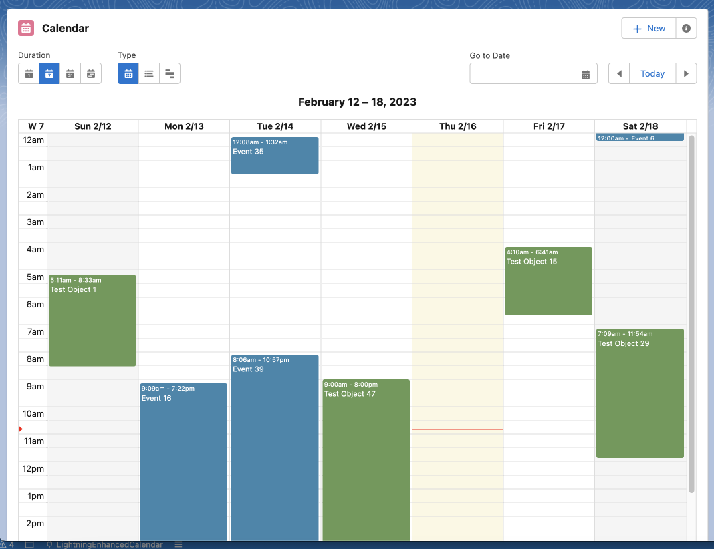
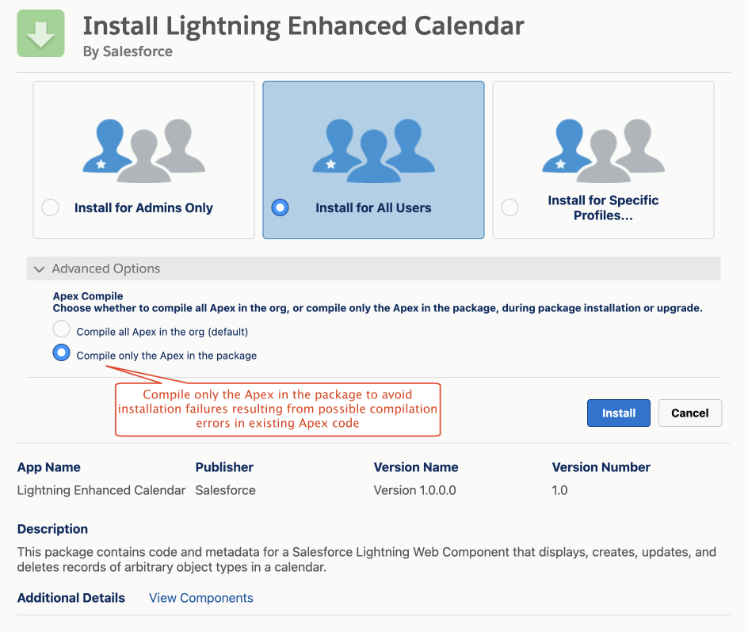
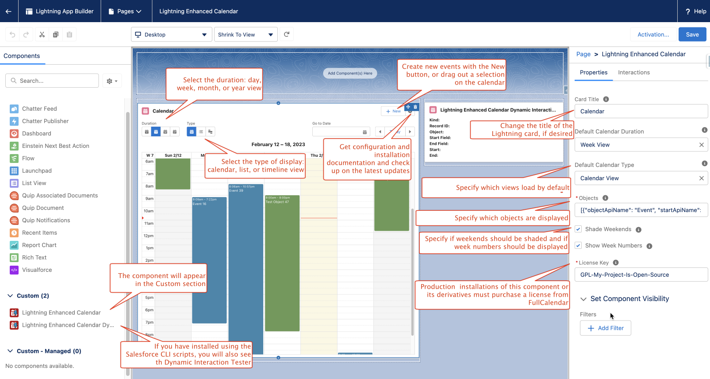
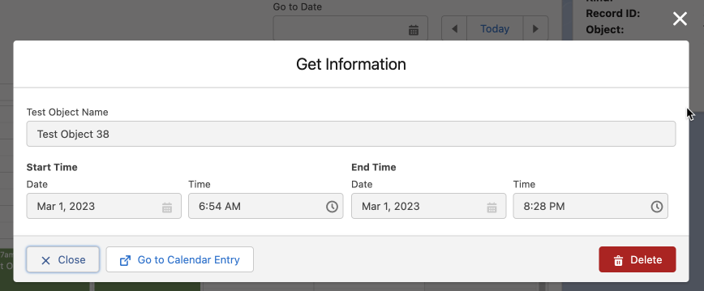
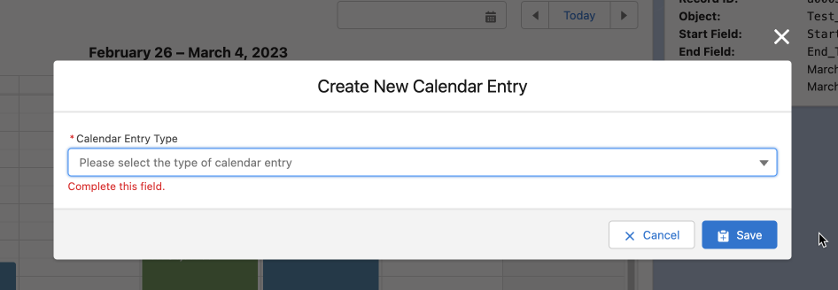
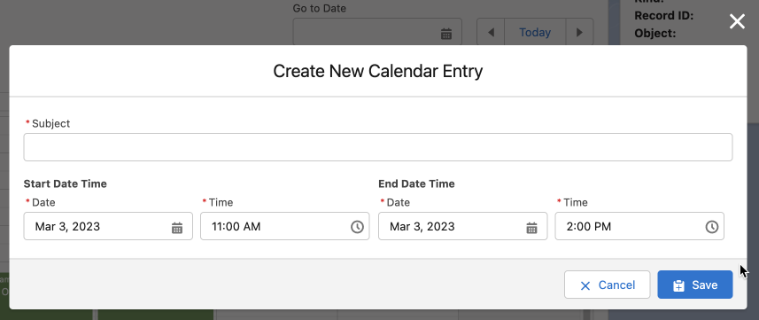
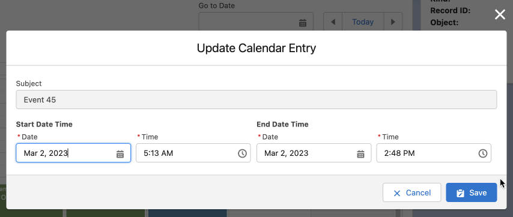

  

<h1 align="center">LIGHTNING ENHANCED CALENDAR</h1>
<p align="center">
This package contains a Lightning Web Component and other support to display, created, update, and delete Salesforce records of arbitrary Salesforce objects (SObjects) in a calendar.
</p>

## Summary

This component implements a self-contained (no off-platform HTTP references) calendar application that can be used for displaying, creating, updating, and deleting Salesforce records of any arbitrary Salesforce object (SObject) in a variety of formats. The only requirement for the SObjects is that they must include `DateTime` fields that represent the start and end times of the calendar entries that are to be displayed.



The package uses the [FullCalendar](https://fullcalendar.io) JavaScript library for all the heavy lifting but places a Salesforce Lightning interface on it for all of the controls.

## Installation

### Installing in a Production or Sandbox Org

This package contains language translations for English, French, German, and Spanish. You must [enable Translation Workbench](https://help.salesforce.com/s/articleView?id=sf.wcc_setup_enable_translation.htm&type=5) as well as those four languages in the org before you can install this package.

Read the disclaimer below and click on one of the **Install the Package** links. This will install all the components and other metadata to your Salesforce org. To avoid possible installation errors, pull down the "Advanced Options" twisty and select "Compile only the Apex in the package":



Once the package is installed, you will need to create a Lightning app, home, or record page with the Lightning App Builder (or an Experience Cloud page with Experience Builder) and drag the `Lightning Enhanced Calendar` custom component onto the page.

Finally, you must assign the `Lightning Enhanced Calendar` permission set to anyone who will be using the component to enable access to the Apex methods used by the component.

### Testing in a Stand-Alone Scratch Org

If you want to test the package in a new scratch org using the [Salesforce Command-Line Interface (CLI)](https://developer.salesforce.com/tools/sfdxcli), there is a script called `scripts/CreateScratchOrg` that can be run from the top-level directory that will create a new scratch org, install all of the components, create the testbed environment with a Lightning app page, generate random calendar entries, and assign all the required permission sets to the default user to make it all work. You must authorize a Dev Hub org before you can run this script. You must also have [jq](https://github.com/stedolan/jq) installed for this and the other scripts in the ``scripts`` folder to work. If you are lucky enough to develop on a Mac, I highly recommend using [Homebrew](https://brew.sh/) for ``jq`` and many other pre-compiled open source utilities.

## Configuration



Once the component is dragged on the desired page in Lightning App Builder, it will be configured initially to display only records from the standard Salesforce `Event` object. The following configuration variables are exposed to the Lightning App Builder and Experience Builder:

- **Card Title**: The title on the Lightning Card (default: "Calendar")
- **Default Calendar Duration**: The duration (day, week, month, or year) that is loaded into the calendar when it first displays.
- **Default Calendar Type**: The type of view (calendar, list, or timeline) that is loaded into the calendar when it first displays.
- **Objects**: A JSON string containing an array of JSON objects describing the Salesforce objects to display (see below for details on the array and its JSON objects).
- **Shade Weekends**: Check this box to set the background color of Saturdays and Sundays to a light gray color.
- **Show Week Numbers**: Check this box to show week numbers in the calendar.
- **License Key**: The Lightning Enhanced Calendar LWC uses several premium plug-ins from FullCalendar which must be licensed if the FullCalendar library is used in a production environment. See the section on **Licensing** below for details and pointers.

Each JSON array in the `Objects` configuration string must look something like this:

```json
[
    {
        "objectApiName": "Event",
        "nameFieldApiName": "Subject",
        "startApiName": "StartDateTime",
        "endApiName": "EndDateTime",
        "color": "#3A87AD"
    },
    {
        "objectApiName": "Race_Track__c",
        "customLabel": "Race Track Alpha",
        "startApiName": "Start_Time__c",
        "endApiName": "End_Time__c",
        "filter": "Name = 'Alpha'",
        "color": "#6A9955"
    },
    {
        "objectApiName": "Race_Track__c",
        "customLabel": "Race Track Bravo",
        "startApiName": "Start_Time__c",
        "endApiName": "End_Time__c",
        "filter": "Name = 'Bravo'",
        "color": "#BA0517"
    }
]
```

Each object has the following keys:

- **objectApiName**: (*mandatory*) The API name of the SObject whose records are to be displayed.
- **customLabel**: (*optional*) A label for the SObject whose records are to be displayed. If not specified, it defaults to the label of the SObject specified by **objectApiName**. This is useful, for example, if the same SObject is specified in multiple JSON object entries in the JSON string but with different **filter**s (see below).
- **nameFieldApiName**: (*optional*) The API name of the field to use for the name of the record displayed in each calendar entry. If omitted, this will default to the name field of the object.
- **startApiName**: (*mandatory*) The API name of the `DateTime` field representing the start date and time of the record to be displayed.
- **endApiName**: (*mandatory*) The API name of the `DateTime` field representing the end date and time of the record to be displayed.
- **filter**: (*optional*) A [Salesforce SOQL WHERE clause expression](https://developer.salesforce.com/docs/atlas.en-us.soql_sosl.meta/soql_sosl/sforce_api_calls_soql_select_conditionexpression.htm) specifying which records of the given SObject to return. If the component is on a Lightning Record Page, you may use ```:recordId``` in the expression to reference the record Id of the page being displayed. This can be useful to restrict calendar entries to those directly related to the displayed record, for example: ```"filter": "StartTime__c > 2005-01-01T01:01:00Z AND OwnerId = :recordId"```
- **color**: (*optional*) A CSS-compatible color representation of the records of this SObject in the display.

**IMPORTANT**: Each key and each value in the `Objects` string *MUST* be surrounded by double-quotes (").

## Using the Component

I hope that once the component is configured properly in Lightning App Builder, using it will be fairly intuitive.

### Viewing a Calendar Entry



To view details of a calendar entry, simply click on the entry in the calendar. You will see the title and the start and end dates for that entry. To see all of the fields in the calendar entry, click on the "Go to Calendar Entry" button and you will be taken to a new tab showing all of the details of that entry.

### Creating a New Calendar Entry



You can create a new calendar entry by clicking the "New" button in the Lightning Card's action panel or by simply dragging open an area on the calendar itself. Once you do, you will be presented with a modal with a pull-down containing the names of all of the objects you specified in the `Objects` JSON string in the App Builder configuration panel. Once you select an SObject, the modal will show a form allowing you to fill in the title and start and end times of the new entry. If you dragged out an area on the calendar itself, it will automatically show you the start and end times:



Once you fill out the form and click "Save", the new calendar entry will be displayed on the calendar and the new record will be inserted into the Salesforce database.

### Updating an Existing Calendar Entry



To update an existing calendar entry, simply grab the entry on the calendar and drag it to where you wish it to go. A modal will pop up showing the new date and time values, which you can further manipulate if you desire.

### Deleting a Calendar Entry


To delete a calendar entry, simply click on the entry to bring up an information dialog. Click on the "Delete" button and, after a confirmation message, the calendar entry and corresponding Salesforce record will be removed.

## Internationalization

The component includes display labels and toast messages for English, Spanish, French, and German. [Google Translate](https://translate.google.com) can only get me so far, though, so if you find any corrections or if you wish to help me include additional language translations, please have a look at the translation metadata and send me updates.

## Bonus Component: Lightning Enhanced Calendar Dynamic Interaction Tester

I have included an additional component that will intercept and display calendar entry creation, update, and deletion events from Lightning Enhanced Calendar using [Lightning Dynamic Interactions](https://admin.salesforce.com/blog/2021/introducing-dynamic-interactions-the-latest-low-code-innovation-for-salesforce-platform). At the time of this writing, however, these are only available in Lightning App pages. The component is there to (1) demonstrate how a component can be written and configured in Lightning App Builder to respond to calendar update events from Lightning Enhanced Calendar and (2) help me test the main LWC code.

If you create a scratch org testbed environment using the included `CreateScratchOrg` script, the `Lightning Enhanced Calendar` app page will be set up with this component already properly configured and a separate permission set, `Lightning Enhanced Calendar Tester`, that grants access to the page and custom tab, assigned to the default user. Note that this component will only be installed in a scratch org using this script and is not included in the installable Salesforce package.

## Caveats, Bugs, and Known Limitations

- The [FullCalendar library](https://fullcalendar.io) version used by this package is 4.3.1, the most recent of the 4.*x* generation, which is (according to several Internet posts at the time of this writing) the last version that works and plays well with the Salesforce Lightning Web Components framework. One day if I have time before I retire, I may try to get things working with a more recent version, but it's not high on my priority list and 4.3.1 does everything I need it to.
- Although the FullCalendar library can handle all-day and repeating events, the LWC does not provide any interface for managing them.
- The calendar may not display on first load even though no errors are displayed. I believe this is due to a race condition somewhere in loading the FullCalendar JavaScript libraries, but have not been able to locate the problem. A page refresh (or two) usually fixes the problem.
- Since the `filter` key of the `Objects` configuration variable is quite literally a [SOQL injection](https://developer.salesforce.com/docs/atlas.en-us.apexcode.meta/apexcode/pages_security_tips_soql_injection.htm), I do not take any defensive action against SOQL injection. If you have opinions about that, please re-read the section below about how this code is meant to help my Salesforce colleagues do customer demonstrations as easily as they can and how this code, as delivered, is not ready for production use. That's why it's licensed under the BSD 3-Clause license. By all means, take whatever steps you need to secure it if you wish to deploy it to a production environment.

## Troubleshooting

- **The component will not install**: You must have Translation Workbench enabled in the target org with English, German, French, and Spanish activated. If you are getting other errors, try pulling down the "Advanced Options" twisty on the Salesforce installer page and select "Compile only the Apex in the package".
- **The component does not display on the page**: If a page refresh (or two) does not fix the problem, make sure you have assigned the `Lightning Enhanced Calendar` permission set to the current user.
- **The component is complaining that my Objects configuration variable is corrupt**: Please double-check your JSON string. The keys must be entered *exactly* as shown (upper- and lower-case is important). Keys and values *must* be surrounded by double-quotes("). Also, the string must represent an array, even if there is only one object to display.
- **The component displays, but the records from one or more of the objects is not showing**: Have a *VERY* careful look at the JSON string and make sure that the API names are absolutely correct.

## Licensing

All of the Salesforce code and metadata in this repository are licensed under the BSD 3-Clause open source license. That basically means that you may freely copy, use, and modify the code and do whatever you want with it, as long as you don't expect to get any support from Salesforce or me. Use and installation of the components are completely at your own risk. Please see the **Caveats** section above before you deploy it into any production environments.

The FullCalendar and Moment libraries contained in the static resource, however, are licensed differently. Unless you are using it with an open source project (as I am), you must license the code from FullCalendar. This package makes use of several premium plug-ins. Please see [FullCalendar's licensing page](https://fullcalendar.io/license) for details.

## How to Deploy This Package to Your Org

I am a pre-sales Solutions Engineer for [Salesforce](https://www.salesforce.com) and I develop solutions for my customers to demonstrate the capabilities of the amazing Salesforce platform. *This package represents functionality that I have used for demonstration purposes and the content herein is definitely not ready for actual production use; specifically, it has not been tested extensively nor has it been written with security and access controls in mind. By installing this package, you assume all risk for any consequences and agree not to hold me or my company liable.* If you are OK with that ...

[Install the Package in Production](https://login.salesforce.com/packaging/installPackage.apexp?p0=04tHu000003srIdIAI)

[Install the Package in a Sandbox](https://test.salesforce.com/packaging/installPackage.apexp?p0=04tHu000003srIdIAI)

## Maintainer

John Meyer, Salesforce Solution Engineer

**Current Version**: 1.0.2

## References

- [Mark Lott's Component](https://github.com/markslott/lwc-fullcalendar): thanks to Mark for finding and making the minor tweak necessary in the `main.js` file to make the FullCalendar library work with the Lightning Web component framework.
- [Year View](https://github.com/p-try/fullcalendar-yearview): I never could get this to work with Lightning, but I find it intriguing nonetheless.
- [AuraEnabled](https://auraenabled.com/2020/07/fullcalendar-in-lightning-web-component/): inspiration
